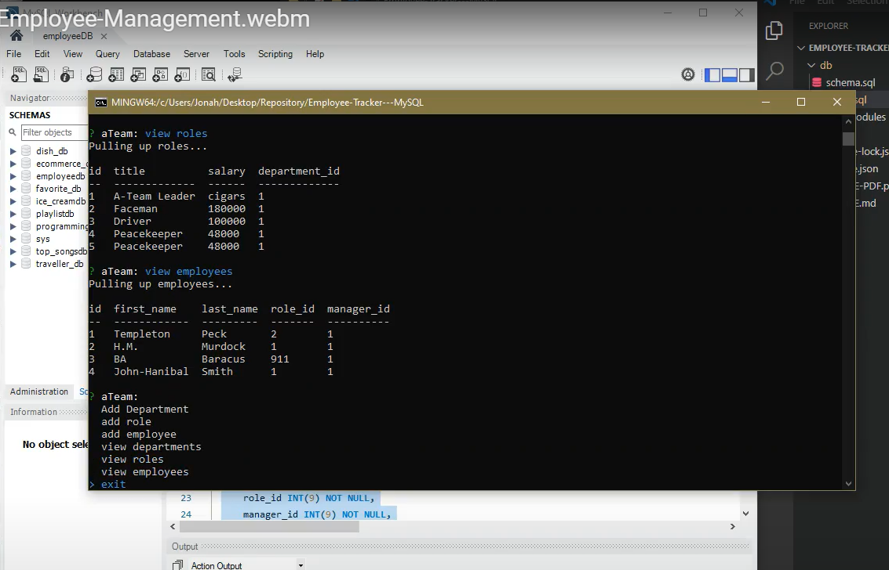

# Employee Tracker - MySQL

### Designer Name
* Jonah Haase 

## Project Description
* Developers are often tasked with creating interfaces that make it easy for non-developers to view and interact with information stored in databases.  In this app, I
architect and build a solution for managing a company's employees using node, inquirer, and MySQL.

# Table of Contents
1. [Links](#links)
2. [Mockup](#mockup)
3. [Project Installation](#project-installation)
4. [Tests](#tests)
5. [License](#license)
6. [Questions](#questions)

## Links
* https://drive.google.com/file/d/1X-0wV1PwwQVcsZe0c75zlaVz9MKPwKUU/view
* https://github.com/jojonah1812/Employee-Tracker---MySQL

## Mockup

## Project Installation
* Inquirer, Node, MySQL 

## Tests
* MySQL

## License
* MIT

## Questions
If you have any questions, please feel free to contact me through my GitHub account or my email address.

* #### GitHub Username    jojonah1812
* #### GitHub Link    https://github.com/jojonah1812
* #### Email    jojonah@gmail.com
